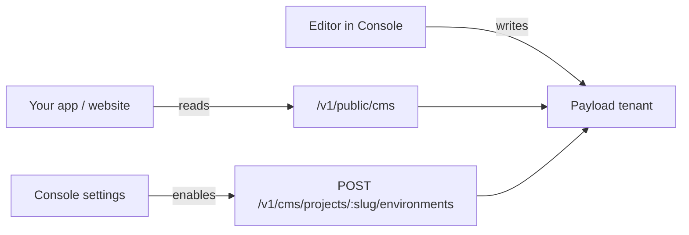

# Content (CMS)

Ovok ships a headless CMS that lives **alongside** your FHIR data plane.
Authors create and edit content in the Console; your apps fetch it over
a thin HTTP surface scoped to your project.

It is opt-in per project. Once enabled, it provisions a dedicated
tenant on the Ovok-managed Payload CMS backend, scoped to your Medplum
project ID — so content from one project is invisible to another.

Before enabling, the `Content` section of the Console shows a single
"Payload CMS · OFF" card pointing you at the toggle:

## When to use it

| Use it for                                                 | Don't use it for                         |
| ---------------------------------------------------------- | ---------------------------------------- |
| Marketing pages, FAQ entries, onboarding flows, legal text | Per-patient clinical content             |
| Localised UI copy your apps render                         | High-volume telemetry                    |
| Provider directories, opt-in disclosures, release notes    | Anything that belongs in a FHIR resource |
| Image / video assets uploaded by your editorial team       | Audit-relevant records                   |

If the content has a FHIR shape (Patient, Observation, Communication,
Questionnaire…), put it in FHIR. The CMS is for the things FHIR doesn't
model — copy, configuration, marketing, media.

## How it fits together

- **Console** — `/settings/general` flips the project into the CMS.
  This provisions the Payload tenant and adds a CMS line item to your
  Stripe subscription. See [Enable CMS](/dev/cms/enable).
- **Authoring API** — `/v1/content/*` is a thin reverse-proxy that
  forwards authenticated requests to the project's Payload tenant.
  Used by the Console and any trusted backend you write. See
  [Authoring with the Content API](/dev/cms/authoring).
- **Delivery API** — `/v1/public/cms/...` serves _published_ content
  with an API key, no JWT needed. This is what your frontend hits.
  See [Public delivery](/dev/cms/public-delivery).

## What you ship against

| Surface      | Path                                  | Auth                 | Caller                       |
| ------------ | ------------------------------------- | -------------------- | ---------------------------- |
| Authoring    | `/v1/content/*`                       | Project JWT (Bearer) | Console, trusted backends    |
| Delivery     | `/v1/public/cms/:typeSlug/items`      | API key header       | Frontend / mobile clients    |
| Provisioning | `/v1/cms/projects/:slug/environments` | Project JWT (admin)  | Console, control plane proxy |

The legacy `/v1/cms/:type/...` routes are still live for backwards
compatibility, but **they are not the recommended surface**. New
integrations should use Content + Delivery above. Legacy routes are
documented in the internal spec only.

## Architecture

The CMS runs on shared **payload-ovok** infrastructure with row-level
tenant isolation and per-environment content partitions. See
[Payload stack](/dev/platform/payload-stack) and
[CMS environments](/dev/cms/environments).

## Next

- [Enable CMS on your project](/dev/cms/enable) — three clicks in the Console
- [CMS environments](/dev/cms/environments) — dev / staging / prod isolation
- [Authoring](/dev/cms/authoring) — write content from your backend
- [Public delivery](/dev/cms/public-delivery) — serve content to apps
- [API keys](/dev/cms/api-keys) — mint, rotate, and scope delivery keys
