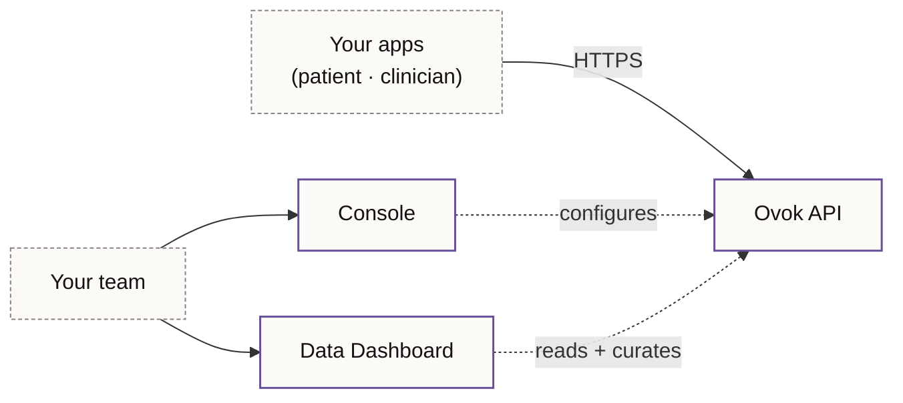

# Build digital health on one platform

Ovok gives digital health teams a single place to ship: a **FHIR-native API**
for clinical and consumer apps, a **Console** for configuring projects
and members, and a **Data Dashboard** for working with the data your
products produce.

One platform. Three release tiers. Two operator surfaces. No
custom backend to maintain.

## What you can build

- **Patient-facing apps** — sign-up, intake, longitudinal records,
  remote monitoring, secure messaging.
- **Clinical workflows** — care plans, encounters, observations,
  diagnostic reports, scheduling.
- **Partner integrations** — device fleets, EHR bridges, payer
  pipelines, analytics exports.

If it lives in a digital health product, you can build it on Ovok
without standing up a new server.

## How the surfaces fit together

The same API powers every product surface — the Console you sign in to,
the Data Dashboard you curate from, and the apps your customers use.
There is no second API.

## Pick a release tier

Every URL on this site honours the **release tier** you've selected in
the top-right navbar. New visitors land on **alpha** by default.

<ApiBase inline={false} />

| Tier      | Maturity    | When to use it                                                |
| --------- | ----------- | ------------------------------------------------------------- |
| **alpha** | Preview     | Building against a capability before it ships. Expect change. |
| **beta**  | Pre-release | Integration tests, partner walkthroughs, contract validation. |
| **final** | Production  | Production traffic. The supported contract.                   |

## What's next

1. Read the [platform overview](./platform/overview.md) for the
   one-page mental model.
2. Skim the [public API map](./platform/public-api) for route families.
3. Skim the [release tiers](./platform/environments.md) page to choose
   the surface you'll build against.
4. Operators — jump to the [Console](./surfaces/console.md).
5. Analysts and clinicians — head for the
   [Data Dashboard](./surfaces/data-dashboard.md).
6. Builders — pick an API surface:
   - [**High Level API**](./api/high-level/index.mdx) — auth, projects,
     content, billing, devices, signals. The convenience layer.
   - [**FHIR API**](./api/fhir/index.mdx) — every FHIR R5 resource,
     served with the standard FHIR REST interactions.
