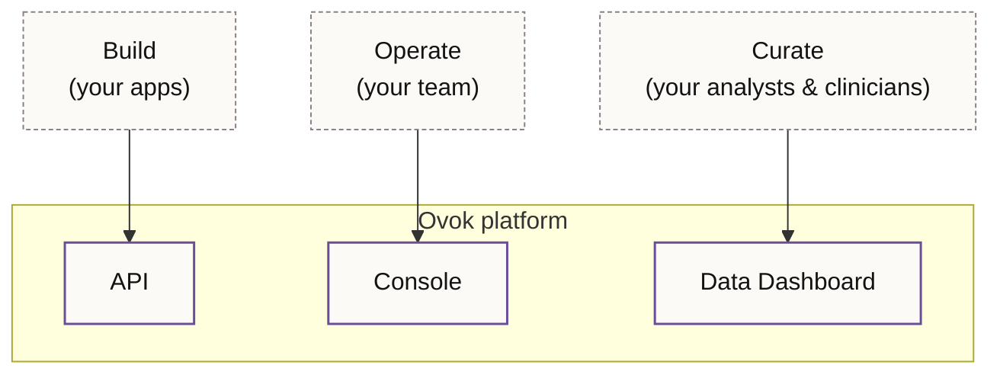

# Platform overview

Ovok is digital health infrastructure delivered as a hosted platform.
You write your product; we run the rest.

## What Ovok gives you

- **A FHIR-native API.** Patients, encounters, observations, care
  plans, diagnostic reports — modelled in FHIR R4 and R5 and exposed
  through one HTTPS API.
- **A Console** for the work that doesn't belong inside your product:
  project setup, member roles, content management, billing, audit.
- **A Data Dashboard** for working with the data your product produces:
  inspecting records, curating cohorts, validating workflows.
- **Three release tiers** — _alpha_, _beta_, _final_ — so you can move
  fast where you need to and stay stable where you must.

## The shape of the surfaces

Each surface speaks to the same data. There is no separate "admin"
backend or "data" backend — the API mediates everything, so the Console
and Data Dashboard are clients like any other.

## What Ovok is not

- **Not a custom EHR.** Clinical data is modelled in open FHIR
  standards — your product is portable.
- **Not a billing system.** Billing federates into Stripe so your
  finance flows aren't locked to us.
- **Not single-tenant.** Every customer is a project on shared,
  managed infrastructure. Tenant boundaries are enforced at the API
  layer.

## Why teams pick Ovok

- **Time to first patient.** Skip months of plumbing — the API,
  Console and Data Dashboard are there on day one.
- **Standards over lock-in.** FHIR is portable. Your records belong to
  you, not to a proprietary schema.
- **Three tiers, one platform.** Ship a preview to one partner on alpha,
  validate on beta, run production on final — all from one project.

## Content (CMS)

Ovok ships an optional headless CMS backed by Payload. It shares the
same API host but uses dedicated Railway services (payload-ovok +
ovok-control-plane) behind ovok-core proxies. See
[Payload stack](./payload-stack) and [Content (CMS)](../cms/index).

## Next

- [Release tiers](./environments.md) — sandbox, alpha, beta, final
- [Payload stack](./payload-stack.mdx) — CMS infrastructure
- [Console](../surfaces/console.md) — the operator surface
- [Data Dashboard](../surfaces/data-dashboard.md) — the data surface
