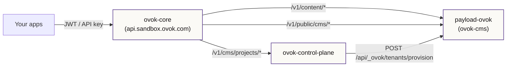

# Payload stack

Ovok's CMS runs as three cooperating services. Your apps never talk to
Payload directly — ovok-core proxies every request and enforces project
boundaries.



## Services

| Service                     | Role                                     | Typical host (sandbox)                             |
| --------------------------- | ---------------------------------------- | -------------------------------------------------- |
| **ovok-core**               | Public API, auth, CMS proxy, cache       | `api.sandbox.ovok.com`                             |
| **ovok-control-plane**      | Project registry, environment enablement | private `ovok-control-plane.railway.internal:4001` |
| **payload-ovok** (ovok-cms) | Multi-tenant Payload CMS runtime         | private `payload-ovok.railway.internal:8080`       |

## Databases

Each backend owns a **separate Postgres** instance:

| Database                | Used by            | Stores                                       |
| ----------------------- | ------------------ | -------------------------------------------- |
| `ovok-cms-postgres`     | payload-ovok       | Tenants, content-types, content-items, media |
| `ovok-control-plane-db` | ovok-control-plane | `projects`, `project_environments`           |

Do not share one database between CMS and control plane — schemas and
migration tooling differ (Payload vs Drizzle).

## Request paths

| Public route (ovok-core)     | Backend            | Purpose                       |
| ---------------------------- | ------------------ | ----------------------------- |
| `/v1/content/*`              | payload-ovok       | Authoring (JWT)               |
| `/v1/public/cms/:type/items` | payload-ovok       | Published reads (API key)     |
| `/v1/cms/projects/*`         | ovok-control-plane | Enable CMS, list environments |

Cluster-internal CMS endpoints (control plane + cache hooks):

| Method | Path                           | Purpose                        |
| ------ | ------------------------------ | ------------------------------ |
| `GET`  | `/api/_ovok/health`            | Liveness + DB check            |
| `GET`  | `/api/_ovok/schema`            | Dashboard form schema          |
| `POST` | `/api/_ovok/tenants/provision` | Idempotent tenant provisioning |

## Environment isolation

Every tenant-scoped document carries an `environment` field (`dev`,
`staging`, or `prod`). Reads and writes are scoped by
`x-ovok-environment` on internal CMS calls. See
[CMS environments](/dev/cms/environments).

## Provisioning flow

1. Console enables CMS → ovok-core calls control plane
   `POST /v1/projects/:slug/environments` with `{ "environment": "dev" }`.
2. Control plane inserts a `project_environments` row (`provisioning`).
3. Control plane calls payload-ovok
   `POST /api/_ovok/tenants/provision` with the Medplum project ID.
4. Row moves to `active`. No new containers — isolation is row-level in
   shared Postgres.

## CMS project routes

Console and trusted backends enable environments through the control
plane proxy:

```
POST /v1/cms/projects/{slug}/environments   → ovok-control-plane
GET  /v1/cms/projects/{slug}                → project + environment matrix
```

## Next

- [Deploy the stack](./deployment) — Railway wiring
- [Enable CMS](/dev/cms/enable) — Console walkthrough
- [CMS environments](/dev/cms/environments) — dev / staging / prod
